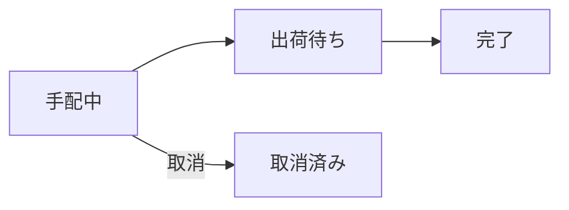
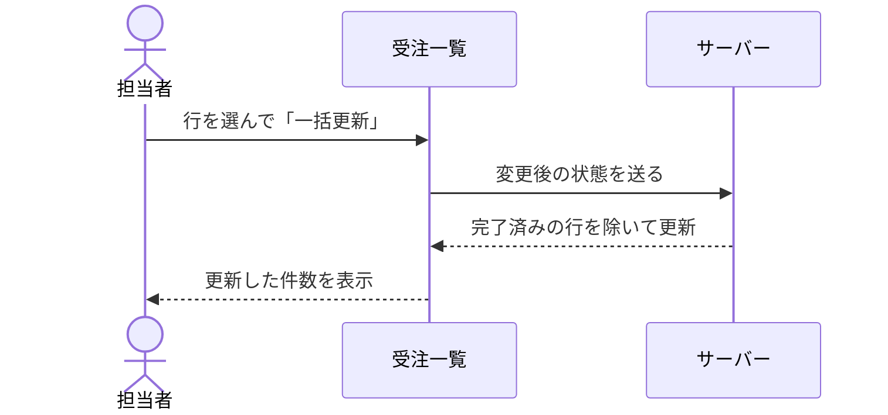

# 図の見本

言語名が `mermaid` のコードブロックは、`codeBlocks.mermaid` に登録した `MermaidBlock` で図になります。図はドロワーのライトとダークに合わせて描かれます。

## 受注の状態



## 一括更新の流れ



## 記法の誤り

記法に誤りがあると、図の代わりにエラー文と元のコードを表示します。

```mermaid
flowchart TD
  A[受注] -->
```
