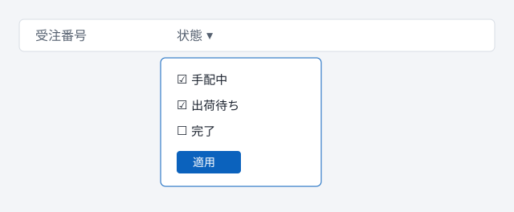

# 受注一覧

受注の検索、状態の確認、まとめての更新を行う画面です。取込の書式は[CSV取込](#csv取込の書式)を、権限については `ROLE_ORDER_EDIT` の説明を参照してください。

## 絞り込み

列見出しをクリックすると、その列の条件を指定できます。

- 文字の列は部分一致で検索します
- 日付の列は範囲で指定します
  - 開始日だけの指定もできます
- 複数の列に指定した条件は、すべて満たす行だけが残ります

## 一括更新

1. 更新したい行を選択します
2. <kbd>Ctrl</kbd> + <kbd>E</kbd> を押して、変更後の状態を選びます
3. 内容を確認して保存します

> [!WARNING]
> 完了済みの行は変更できません。選択に含まれている場合、その行だけ更新されずに残ります。

| 状態 | 変更 | 備考 |
| :-- | :-: | :-- |
| 手配中 | 可 | 制限なし |
| 出荷待ち | 可 | 手配中には戻せません |
| 完了 | 不可 | 管理者に依頼してください |

> [!TIP]
> 絞り込んだ状態で全選択すると、表示中の行だけが対象になります。

### CSV取込の書式

```csv
受注番号,状態,出荷予定日
A-10231,出荷待ち,2026-10-12
A-10232,手配中,
A-10233,完了,2026-10-02
```

### 保存前の確認

- [x] 対象の件数が想定どおりである
- [x] 完了済みの行が含まれていない
- [ ] 出荷予定日が空欄の行を確認した

> 保存した内容は変更履歴に記録され、あとから確認できます。

> [!NOTE]
> 一覧は50件ずつ表示されます。

> [!IMPORTANT]
> 月次の締め処理中は、更新が一時的に止まります。

> [!CAUTION]
> 取消は元に戻せません。

#### 文字の装飾

**太字**、*斜体*、~~取り消し線~~、<mark>強調</mark>、H<sub>2</sub>O、x<sup>2</sup>、改行は行末にスペース2つ  
または `<br>` で入れます。<br>長い英数字の例: ORDER_STATUS_SHIPPING_WAITING_FOR_CONFIRMATION_BY_ADMINISTRATOR[^1]

## よくある質問

<details>
<summary>保存ボタンが押せません</summary>

必須の項目が空欄のときは、保存ボタンが押せません。赤い枠の項目を確認してください。

</details>

<details open>
<summary>絞り込みを解除するには</summary>

表の右上にある「条件をクリア」を押します。列ごとに解除する場合は、列見出しからその条件を消します。

</details>



---

関連: [在庫照会](stock.md)、[社内ポータルの運用手順](https://example.com/portal)

[^1]: 権限の名前は、管理画面の「ロール」で確認できます。
